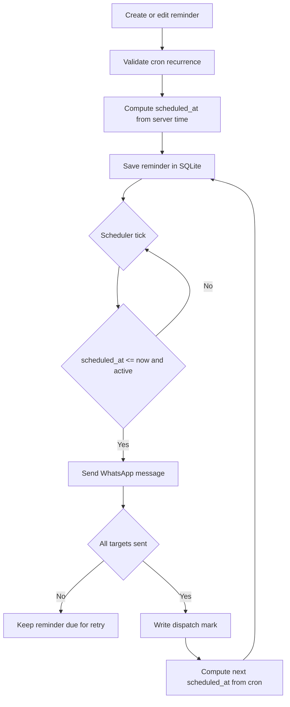

# Reminder-In

<p align="center">
  
</p>

**ReminderIn** is a private WhatsApp reminder dashboard for scheduling recurring reminders and sending them to yourself, contacts, groups, or direct WhatsApp JIDs.

It runs as a lightweight Go web app with SQLite persistence, WhatsApp Web multi-device integration through whatsmeow, cron-based scheduling, QR or phone-code pairing, and a simple browser dashboard protected by cookie-based JWT authentication.

> **Personal automation note:** This project uses WhatsApp Web automation through whatsmeow. Keep the dependency updated because WhatsApp periodically rejects outdated web protocol versions.

## Features

- Login-protected dashboard with HTTP-only JWT cookie auth.
- IP-based login attempt limiter and same-origin request protection.
- WhatsApp linking through QR scan or phone pairing code.
- Recurring reminder scheduling with 5-field cron expressions.
- Server-side scheduled time calculation from recurrence and current server time.
- Safe re-enable behavior that recalculates stale disabled reminders before they run.
- Multi-target delivery to yourself, phone numbers, groups, or WhatsApp JIDs.
- Per-target dispatch marks so partial delivery failures retry only failed targets.
- SQLite persistence for reminders, app settings, and WhatsApp session data.
- Search, sort, pagination, and ETag caching for the reminder list.
- WhatsApp safe-session handling for outdated-client outages without deleting local sessions.
- Docker image publishing to GHCR and optional Watchtower auto-update deployment.

## Tech Stack

| Layer | Stack |
| ----- | ----- |
| Backend | Go 1.25, net/http, chi |
| Database | SQLite, mattn/go-sqlite3, WAL mode |
| Scheduler | robfig/cron v3 |
| WhatsApp | whatsmeow |
| Auth | golang-jwt/jwt v5, HTTP-only cookies |
| Frontend | HTML, CSS, Vanilla JavaScript |
| Container | Docker, GHCR, Watchtower |
| CI | GitHub Actions, Dependabot |

## Project Structure

```text
.
├── cmd/api/                 # HTTP server entrypoint and scheduler runtime
│   ├── main.go
│   ├── scheduler.go
│   └── scheduler_test.go
├── internal/
│   ├── handler/             # API handlers, auth, QR/pairing, reminder endpoints
│   ├── store/               # SQLite persistence, dispatch marks, settings
│   └── whatsapp/            # whatsmeow client manager and WA operations
├── web/static/              # Browser dashboard assets
│   ├── index.html
│   ├── css/
│   └── js/
├── .github/                 # Docker image and Dependabot automation
├── Dockerfile
├── docker-compose.yml
├── .env.example
├── go.mod
└── README.md
```

The web dashboard and the API server are the only application paths in this repository.

## Configuration

Create a local environment file from the example:

```bash
cp .env.example .env
```

Main configuration fields:

| Key | Required | Default | Description |
| --- | -------- | ------- | ----------- |
| `REMINDERIN_USERNAME` | Yes | - | Admin username for dashboard login |
| `REMINDERIN_PASSWORD` | Yes | - | Admin password for dashboard login |
| `JWT_SECRET` | Yes | - | JWT signing secret; use at least 32 random bytes |
| `PORT` | No | `8080` | HTTP server port |
| `DB_PATH` | No | `data/reminderin.db` | Main SQLite database path |
| `JWT_EXP_HOURS` | No | `168` | Login session lifetime in hours |
| `WA_LOAD_ALL_CLIENTS` | No | `false` | Load all stored WA sessions on startup |
| `HTTP_ACCESS_LOG` | No | `false` | Enable HTTP request logs |
| `LOGIN_MAX_ATTEMPTS` | No | `5` | Failed login attempts before temporary lock |
| `LOGIN_LOCK_SECONDS` | No | `60` | Temporary login lock duration |
| `TRUST_PROXY_HEADERS` | No | `false` | Trust reverse-proxy forwarding headers |
| `WA_MAX_LINK_SESSIONS` | No | `2` | Max concurrent WhatsApp linking sessions |
| `WA_SEND_TIMEOUT_SECONDS` | No | `20` | WhatsApp message send timeout |
| `WA_QUERY_TIMEOUT_SECONDS` | No | `20` | Contacts and groups query timeout |
| `WA_DIRECTORY_CACHE_TTL_SECONDS` | No | `60` | Contacts and groups cache TTL |
| `WA_LOG_LEVEL` | No | `WARN` | whatsmeow logger level |
| `WA_SEND_DELAY_MS` | No | `2000` | Base randomized delay between target sends |
| `WA_KEEPALIVE_MINUTES` | No | `5` | Internal WA health loop interval |
| `REMINDER_DUE_BATCH_LIMIT` | No | `200` | Max due reminders processed per scheduler cycle |

Keep `.env`, SQLite databases, and WhatsApp session files private.

## Getting Started

### Prerequisites

- [Go](https://go.dev/doc/install) 1.25 or newer
- CGO-capable compiler for SQLite builds
- WhatsApp account with multi-device support
- Docker, if running the container deployment

### Setup

1. Clone the repository:

```bash
git clone https://github.com/Hilmi-Raif/Reminder-In.git
cd Reminder-In
```

2. Create local configuration:

```bash
cp .env.example .env
```

3. Fill required values in `.env`:

```env
REMINDERIN_USERNAME=your_admin_username
REMINDERIN_PASSWORD=your_strong_password
JWT_SECRET=your_random_secret_min_32_bytes
```

4. Download Go dependencies:

```bash
go mod download
```

5. Run the app:

```bash
go run ./cmd/api
```

6. Open the dashboard:

```text
http://localhost:8080
```

7. Link WhatsApp from the dashboard using QR scan or phone pairing code.

## Docker Deployment

The published image is available from GitHub Container Registry:

```text
ghcr.io/hilmi-raif/reminder-in:latest
```

Run with Docker Compose:

```bash
cp .env.example .env
docker compose pull
docker compose up -d
```

The default compose file stores persistent data under:

```text
/app/reminderin/data
```

Inside the container, the app uses:

```text
/app/data/reminderin.db
```

Watchtower is included in `docker-compose.yml` to poll GHCR and update the `reminderin-app` container automatically.

## Commands

| Command | Description |
| ------- | ----------- |
| `go run ./cmd/api` | Run the local API and web dashboard |
| `go test ./...` | Run all Go tests |
| `go build ./cmd/api` | Build the API binary |
| `docker compose up -d` | Start the GHCR image deployment |
| `docker compose pull` | Pull the latest published image |
| `docker logs -f reminderin-app` | Follow app logs |
| `docker logs -f reminderin-updater` | Follow Watchtower update logs |

## Reminder Flow



The cron expression is the source of truth for recurring reminders. The stored `scheduled_at` value is the next scheduled execution time computed by the server.

## WhatsApp Session Handling

ReminderIn stores WhatsApp session data in SQLite under the persistent data directory. If WhatsApp rejects an outdated web client version, the app stops reconnect spam and preserves the local session so a new deployment can reconnect after the dependency/image is updated.

Keep the Docker image and `go.mau.fi/whatsmeow` dependency current. Dependabot and the Docker image workflow are included to reduce manual update work.

## Data Storage

Default local development database:

```text
data/reminderin.db
```

Default Docker data directory:

```text
/app/reminderin/data
```

Common files in the Docker data directory:

| File | Description |
| ---- | ----------- |
| `reminderin.db` | Main app data, reminders, settings, and dispatch marks |
| `wa_sessions.db` | WhatsApp multi-device session data |
| `*.db-wal`, `*.db-shm` | SQLite WAL sidecar files |

Back up the whole data directory before changing deployment paths or moving servers.

## Notes

- The current dashboard is recurrence-first and requires a cron expression for reminders.
- Disabled reminders are not processed; re-enabling a recurring reminder recalculates its next scheduled time from the current server time.
- Set `TZ=Asia/Jakarta` or another timezone explicitly in Docker so cron calculations match your expected local time.
- Do not commit `.env`, database files, WhatsApp session files, logs, or deployment archives.
- If WhatsApp requires a newer web client version, update the image or dependency, rebuild, and redeploy.
