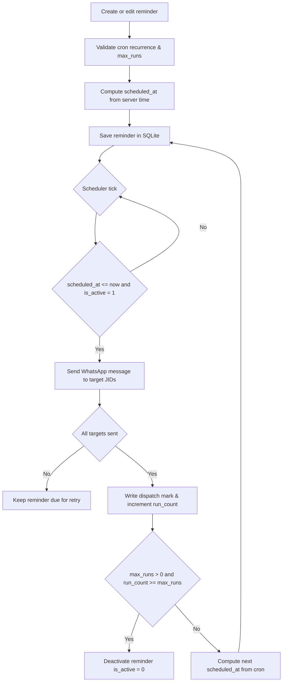

# Reminder-In

<p align="center">
  
</p>

**ReminderIn** is a private WhatsApp reminder dashboard for scheduling recurring reminders and sending them to yourself, contacts, groups, or direct WhatsApp JIDs.

It runs as a lightweight Go web app with SQLite persistence, WhatsApp Web multi-device integration through whatsmeow, cron-based scheduling, QR or phone-code pairing, and a Neobrutalist browser dashboard protected by cookie-based JWT authentication.

> **Personal automation note:** This project uses WhatsApp Web automation through whatsmeow. Keep the dependency updated because WhatsApp periodically rejects outdated web protocol versions.

## Features

- **Login-Protected Dashboard**: HTTP-only JWT cookie auth with bcrypt password hashing.
- **WhatsApp Multi-Device Pairing**: Linking via QR code scan or 8-digit phone pairing code.
- **Cron Recurrence & Max Runs**: 5-field cron expression scheduling with optional repeat limit (`max_runs`).
- **Rich Text Message Editor**: Quill-powered editor with conversion to WhatsApp markdown formatting (`*bold*`, `_italic_`, `~strikethrough~`, ````code````).
- **Multi-Message Batch Scheduling**: Schedule multiple messages simultaneously in a single submission.
- **Multi-Target Delivery**: Send reminders to yourself, phone numbers, groups, or WhatsApp JIDs.
- **Partial Delivery Resilience**: Per-target dispatch marks ensure retries only process unsent targets.
- **Bilingual Support**: Runtime language switching between English (EN) and Indonesian (ID).
- **Light & Dark Mode**: Integrated theme toggle.
- **SQLite Persistence**: WAL-mode SQLite database storing reminders, settings, and session data.
- **Search, Sort & Pagination**: Server-side pagination, message search, and column sorting.

## Tech Stack

| Layer | Stack |
| ----- | ----- |
| Backend | Go 1.25, net/http, chi |
| Database | SQLite, mattn/go-sqlite3, WAL mode |
| Scheduler | robfig/cron v3 |
| WhatsApp | whatsmeow |
| Auth | Bcrypt, golang-jwt/jwt v5 |
| Frontend | HTML, CSS, Vanilla JS, Quill.js |
| Container | Docker |

## Project Structure

```text
.
├── cmd/
│   ├── api/                 # HTTP server entrypoint and scheduler runtime
│   └── genhash/             # CLI utility to generate bcrypt password hashes
├── internal/
│   ├── handler/             # API handlers and auth endpoints
│   ├── store/               # SQLite persistence and database logic
│   └── whatsapp/            # WhatsApp client manager and message operations
├── web/
│   ├── embed.go             # Embedded static web assets
│   └── static/              # Browser dashboard UI assets
│       ├── css/             # Stylesheets and theme variables
│       ├── fonts/           # Local font assets (Cera Round Pro)
│       ├── js/              # Frontend ES modules (components, i18n, store, utils)
│       │   ├── api/
│       │   ├── components/
│       │   ├── i18n/
│       │   ├── store/
│       │   ├── utils/
│       │   └── main.js
│       ├── favicon.svg
│       ├── logo.svg
│       ├── logo-dark.svg
│       └── index.html
├── .github/
│   └── workflows/           # CI/CD and automated workflows
├── Dockerfile
├── docker-compose.yml
├── .env.example
├── go.mod
└── README.md
```

## Configuration

Create a local environment file from the example:

```bash
cp .env.example .env
```

Main configuration fields:

| Key | Required | Default | Description |
| --- | -------- | ------- | ----------- |
| `REMINDERIN_USERNAME` | Yes | - | Admin username for dashboard login |
| `REMINDERIN_PASSWORD_HASH` | Yes | - | Bcrypt password hash for dashboard login (generated via `go run ./cmd/genhash <password>`) |
| `JWT_SECRET` | Yes | - | JWT signing secret; use at least 32 random bytes |
| `PORT` | No | `8080` | HTTP server port |
| `DB_PATH` | No | `data/reminderin.db` | Main SQLite database path |
| `JWT_EXP_HOURS` | No | `168` | Login session lifetime in hours |
| `WA_LOAD_ALL_CLIENTS` | No | `false` | Load all stored WA sessions on startup |
| `HTTP_ACCESS_LOG` | No | `false` | Enable HTTP request logs |
| `LOGIN_MAX_ATTEMPTS` | No | `5` | Failed login attempts before temporary lock |
| `LOGIN_LOCK_SECONDS` | No | `60` | Temporary login lock duration |
| `TRUST_PROXY_HEADERS` | No | `false` | Trust reverse-proxy forwarding headers |
| `WA_MAX_LINK_SESSIONS` | No | `2` | Max concurrent WhatsApp linking sessions |
| `WA_SEND_TIMEOUT_SECONDS` | No | `20` | WhatsApp message send timeout |
| `WA_QUERY_TIMEOUT_SECONDS` | No | `20` | Contacts and groups query timeout |
| `WA_DIRECTORY_CACHE_TTL_SECONDS` | No | `60` | Contacts and groups cache TTL |
| `WA_LOG_LEVEL` | No | `WARN` | whatsmeow logger level |
| `WA_SEND_DELAY_MS` | No | `2000` | Base randomized delay between target sends |
| `WA_KEEPALIVE_MINUTES` | No | `5` | Internal WA health loop interval |
| `REMINDER_DUE_BATCH_LIMIT` | No | `200` | Max due reminders processed per scheduler cycle |

Keep `.env`, SQLite databases, and WhatsApp session files private.

## Getting Started

### Prerequisites

- [Go](https://go.dev/doc/install) 1.25 or newer
- CGO-capable compiler for SQLite builds
- WhatsApp account with multi-device support
- Docker, if running containerized deployment

### Setup

1. Clone the repository:

```bash
git clone https://github.com/Hilmi-Raif/Reminder-In.git
cd Reminder-In
```

2. Create local configuration:

```bash
cp .env.example .env
```

3. Generate bcrypt password hash and fill required values in `.env`:

```bash
go run ./cmd/genhash your_strong_password
```

```env
REMINDERIN_USERNAME=your_admin_username
REMINDERIN_PASSWORD_HASH=output_from_genhash
JWT_SECRET=your_random_secret_min_32_bytes
```

4. Download Go dependencies:

```bash
go mod download
```

5. Run the app:

```bash
go run ./cmd/api
```

6. Open the dashboard:

```text
http://localhost:8080
```

7. Link WhatsApp from the dashboard using QR scan or phone pairing code.

## Docker Deployment

The published multi-arch image (`linux/amd64`, `linux/arm64`) is available from GitHub Container Registry:

```text
ghcr.io/hilmi-raif/reminder-in:latest
```

Run with Docker Compose:

```bash
cp .env.example .env
docker compose pull
docker compose up -d
```

The default compose file stores persistent data under:

```text
/app/reminderin/data
```

Inside the container, the app uses:

```text
/app/data/reminderin.db
```

Watchtower is included in `docker-compose.yml` to poll GHCR and update the `reminderin-app` container automatically.

## Commands

| Command | Description |
| ------- | ----------- |
| `go run ./cmd/api` | Run local API and web dashboard |
| `go test ./...` | Run all Go unit tests |
| `go run ./cmd/genhash <password>` | Generate bcrypt hash for password |
| `go build ./cmd/api` | Build API binary |
| `docker compose up -d` | Start GHCR image deployment |
| `docker compose pull` | Pull latest published image |
| `docker logs -f reminderin-app` | Follow app logs |
| `docker logs -f reminderin-updater` | Follow Watchtower update logs |

## Reminder Flow


```mermaid
flowchart TD
    A[Create or edit reminder] --> B[Validate cron recurrence & max_runs]
    B --> C[Compute scheduled_at from server time]
    C --> D[Save reminder in SQLite]
    D --> E{Scheduler tick}
    E --> F{scheduled_at <= now and is_active = 1}
    F -->|No| E
    F -->|Yes| G[Send WhatsApp message to target JIDs]
    G --> H{All targets sent}
    H -->|No| I[Keep reminder due for retry]
    H -->|Yes| J[Write dispatch mark & increment run_count]
    J --> K{max_runs > 0 and run_count >= max_runs}
    K -->|Yes| L[Deactivate reminder is_active = 0]
    K -->|No| M[Compute next scheduled_at from cron]
    M --> D
```

The cron expression is the source of truth for recurring reminders. The stored `scheduled_at` value is the next scheduled execution time computed by the server. If `max_runs` is specified, the reminder automatically deactivates once `run_count` reaches the limit.

## WhatsApp Session Handling

ReminderIn stores WhatsApp session data in SQLite under the persistent data directory. If WhatsApp rejects an outdated web client version, the app stops reconnect spam and preserves the local session so a new deployment can reconnect after the dependency/image is updated.

Keep the Docker image and `go.mau.fi/whatsmeow` dependency current. Dependabot and the Docker image workflow are included to reduce manual update work.

## Data Storage

Default local development database:

```text
data/reminderin.db
```

Default Docker data directory:

```text
/app/reminderin/data
```

Common files in the Docker data directory:

| File | Description |
| ---- | ----------- |
| `reminderin.db` | Main app data, reminders, settings, and dispatch marks |
| `wa_sessions.db` | WhatsApp multi-device session data |
| `*.db-wal`, `*.db-shm` | SQLite WAL sidecar files |

Back up the whole data directory before changing deployment paths or moving servers.

## Notes

- Disabled reminders are not processed; re-enabling a recurring reminder recalculates its next scheduled time from current server time and resets `run_count = 0`.
- Set `TZ=Asia/Jakarta` or another timezone explicitly in Docker so cron calculations match your expected local time.
- Do not commit `.env`, database files, WhatsApp session files, logs, or deployment archives.
